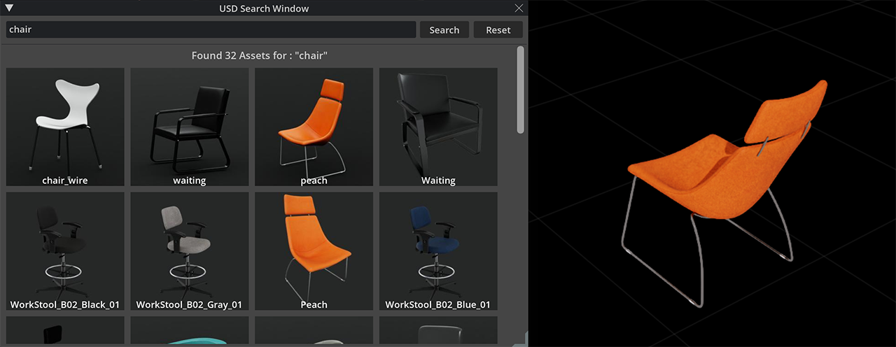

# USD Search Window [omni.kit.window.usd_search]

## Overview

A simple UI that demonstrates USD Search API queries.

## How to Use

> **NOTE :** *Temp files are stored in **`[extension]/assets/`** - empty if too large.*

- Launch this extension from **Window** drop-down menu.

- Type in a search term and press **[ENTER]** or click **[Search]** button.

- Use descriptive searches such as **"cardboard box"** or **"red chairs"**.

- **Left click on thumbnails** to add / remove from selection.

- **Drag selection to viewport** to import assets to stage.

- **Left click on background** to clear selection.

- **Right click on thumbnail** to open menu.

## API Key Requirements

[**Click to get API Key**](https://nvidia.github.io/GenerativeAIExamples/latest/api-catalog.html#get-an-api-key-for-the-accessing-models-on-the-api-catalog) - add it to **NVIDIA_API_KEY - `env.variable`** or [**`config/extension.toml`**](config/extension.toml)

>  **NOTE :** *Restart relevant **kit-app terminals** after changing environment variables.*

## License

This repository contains software governed by the [LICENSE](LICENSE.txt) and NVIDIA Omniverse software and materials. NVIDIA Omniverse is governed by the [NVIDIA Agreements | Enterprise Software | NVIDIA Software License Agreement](https://www.nvidia.com/en-us/agreements/enterprise-software/nvidia-software-license-agreement/) and [NVIDIA Agreements | Cloud Services | Service-Specific Terms for NVIDIA Omniverse Cloud](https://www.nvidia.com/en-us/agreements/cloud-services/service-specific-terms-for-omniverse-cloud/). By downloading or using NVIDIA Omniverse, you agree to the NVIDIA Omniverse terms
